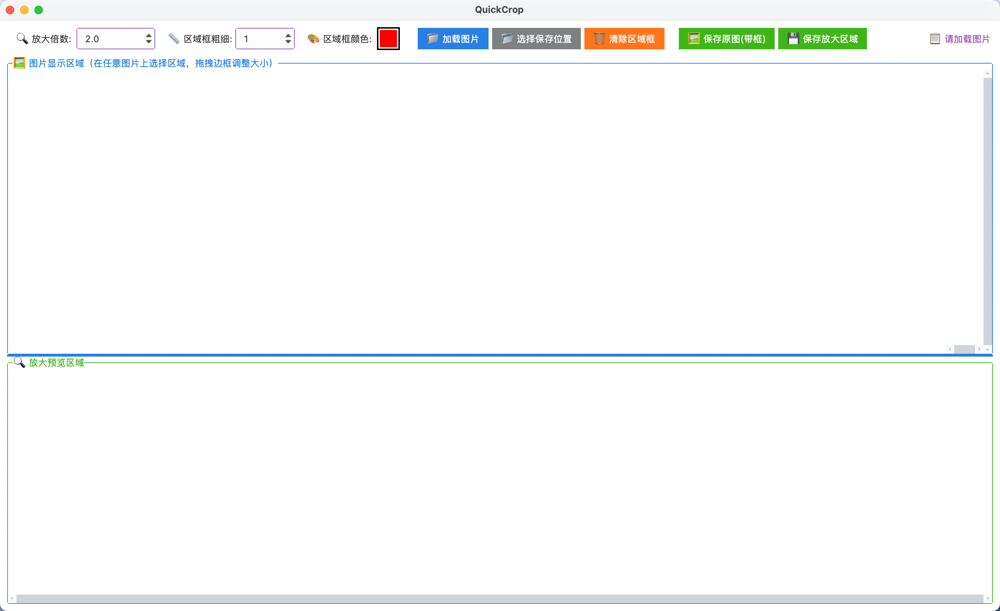

# QuickCrop
区域批量截图工具,支持多图同时选中区域,截取区域放大保存。
有时候论文展示图的时候需要对若干算法对比图进行同一个细节区域放大，人工裁剪很难保证同一个区域，重复写代码又很麻烦，于是开发了QuickCrop这款工具。
目前支持的功能：
- [x] 区域框颜色更改
- [x] 放大区域不同倍数保存
- [x] 支持自定义保存路径
- [x] 保存放大的区域
- [x] 保存带区域框的原图

TODO:
- [x] windows平台优化
- [ ] mac平台按钮略有卡顿，多点几次，后续优化
- [ ] linux平台测试优化
- [ ] 各平台图标优化
      

